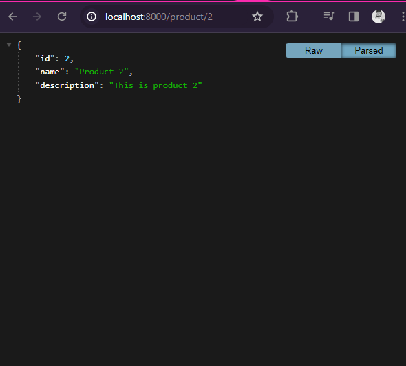

# Backend

This is a simple Backend build with Deno and postgres.

Its purpose is to enhance Web3AR App.

### Quickstart

1. `./postgres_check.sh`
2. `deno run test --allow-net --allow-read`
3. `deno run --allow-env --allow-net --allow-read ./app.ts`
4. Go to http://localhost:8000/product/2
