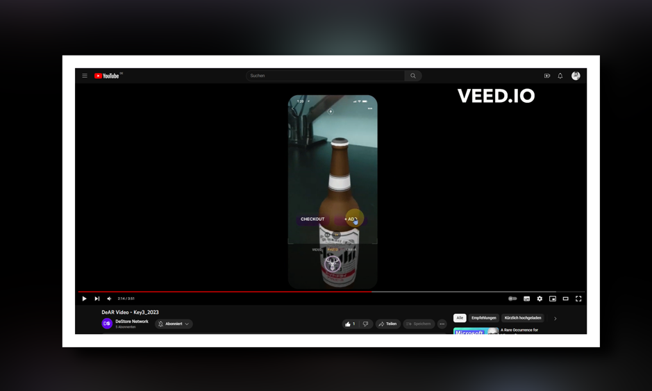

<h3 align="center">Key3D</h3>
  

    One Product, 3 Dimensions
     
    <a href="https://www.figma.com/file/qRxZ8cGgMzSzkXVlJCWT7r/Untitled?type=design&node-id=0%3A1&mode=design&t=DcRb7pW8QcXjCKaM-1" name="Figma">Figma</a>
    ·
    <a href="https://www.veed.io/view/92440012-a395-46d5-b8b5-3ea5cba41642?panel=share">Video</a>
    ·
    <a href="https://github.com/FrankBevr/Key3D">Code</a>
    ·
    <a href="https://key3d.surge.sh">Docs</a>
  

### Video

<a href="https://www.veed.io/view/92440012-a395-46d5-b8b5-3ea5cba41642?panel=share">
</img>
</a> 

### Summary

**Overall**

- Generate [Idea](./docs/Notes/Software-Design-3.md)
- Generate
  [Figma](https://www.figma.com/file/qRxZ8cGgMzSzkXVlJCWT7r/Untitled?type=design&node-id=0%3A1&mode=design&t=DcRb7pW8QcXjCKaM-1)
- Generate continuously [Documentation](https://key3d.surge.sh)
- Skretch out `./SmartContract`, `./Backend`
- Frontend Section unfinished, desired goal definied in
  [MVP Recfactor](./UiUx/DeAr-JapanHack.pdf)
- Generate [Video](https://www.veed.io/view/92440012-a395-46d5-b8b5-3ea5cba41642?panel=share)

**More Details**

- Read Summary [here](https://key3d.surge.sh/Journey/Frank-Summary.html)

### Team

| Name          | Discord   | Telegram       | E-mail                   | Face                                           |
| :------------ | :-------- | :------------- | :----------------------- | :--------------------------------------------- |
| Frank Dierolf | frankbevr | @frankbevr     | `frank_dierolf@web.de`   | [Frank](https://i.ibb.co/0cBM1gp/image.png)    |
| Josiah Kotzur | -         | @doinglifewell | `josiah@destore.network` | [Josiah](https://i.ibb.co/jTwKNqv/image-1.png) |
